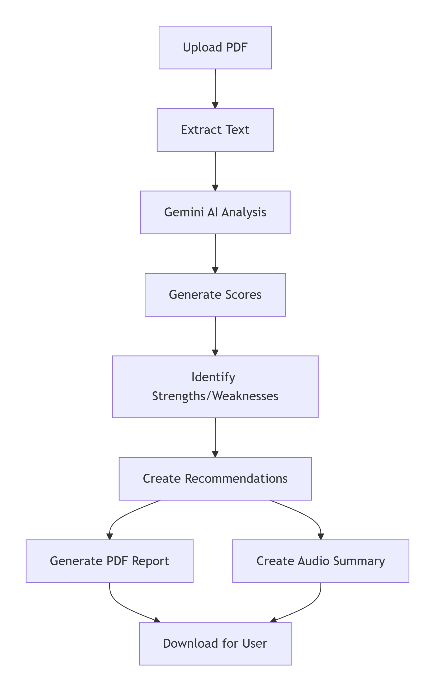

# 📄 AI Resume Analyzer
# Author: Imtiaz Ahmed Adar [LinkedIn](https://www.linkedin.com/in/imtiaz-ahmed-adar)

[](https://www.python.org/)
[](https://streamlit.io/)
[](https://makersuite.google.com/)
[](https://en.wikipedia.org/wiki/Application_tracking_system)
[](LICENSE)

**AI-powered resume analysis tool that provides ATS scoring, job matching, and actionable feedback to help you land your dream job.**

[🚀 Live Demo](https://tinyurl.com/AiResumeAnalysisImtiazAdar) • [📧 Contact](mailto:imtiazadarofficial@gmail.com)

---

## 🌟 Overview

AI Resume Analyzer is an intelligent tool that evaluates resumes against industry standards and specific job descriptions. Using Google's Gemini 2.5 Flash AI, it provides comprehensive feedback including ATS compatibility scores, job match percentages, strengths/weaknesses analysis, and actionable recommendations.

### Why This Tool is Essential

| Feature | Impact on Job Search |
|---------|---------------------|
| **ATS Score** | 75% of resumes rejected before human review |
| **Job Match** | Increases interview chances by 3x |
| **Grammar Check** | 59% of recruiters reject due to typos |
| **Formatting Analysis** | Improves readability by 80% |
| **Audio Feedback** | Learn on-the-go |

---

## ✨ Key Features

### 📊 ATS Compatibility Scoring
- **Algorithm-Based Evaluation**: Analyzes resume against ATS bots
- **Keyword Optimization**: Identifies missing industry terms
- **Formatting Check**: Detects complex layouts that confuse ATS
- **Readability Score**: Ensures clean text extraction

### 🎯 Job Description Matching
- **Semantic Analysis**: Compares resume with JD requirements
- **Skill Gap Detection**: Identifies missing qualifications
- **Role Alignment**: Evaluates experience relevance
- **Custom Scoring**: 0-100 match percentage

### 📝 Comprehensive Analysis
Analysis Categories:  
├── Strengths (What you're doing right)  
├── Weaknesses (Areas needing improvement)  
├── Missing Skills (Keywords to add)  
├── Grammar Issues (Language improvements)  
├── Formatting Suggestions (Layout fixes)  
└── Recommendations (Actionable steps)  


### 🔊 Multi-Format Output
- **Visual Dashboard**: Color-coded scores and progress bars
- **PDF Report**: Professional downloadable analysis
- **Audio Summary**: Listen to feedback on-the-go
- **Detailed Analysis**: Expandable section for deep insights

---

## 🛠️ Technology Stack

| Component | Technology | Purpose |
|-----------|------------|---------|
| **Frontend** | Streamlit | Interactive web UI |
| **AI Engine** | Google Gemini 2.5 Flash | Resume analysis & scoring |
| **PDF Processing** | PyPDF2 | Text extraction from resumes |
| **Report Generation** | ReportLab | PDF report creation |
| **Text-to-Speech** | gTTS | Audio feedback generation |
| **Data Handling** | JSON | Structured analysis output |



## 📋 Prerequisites

- Python 3.11 or higher
- Google Gemini API Key ([Get Free Key](https://makersuite.google.com/app/apikey))
- PDF resumes for testing
- Internet connection

---

## 🔧 Installation


**1. Create Virtual Environment**  
```
# Windows
python -m venv venv
venv\Scripts\activate

# Mac/Linux
python3 -m venv venv
source venv/bin/activate
```
**2. Install Dependencies**
```
pip install -r requirements.txt
```
**3. Set Up API Key**
```
Option A: Streamlit Secrets (Recommended for Deployment)

toml
# .streamlit/secrets.toml
GEMINI_API_KEY = "your_gemini_api_key_here"
```
Option B: Environment Variable
```

# Create .env file
GEMINI_API_KEY=your_gemini_api_key_here
```
**4. Run the Application**
```
streamlit run app.py
The app will open at http://localhost:8501
```

# 🎮 Usage Guide
**Step-by-Step Instructions**
- Upload Your Resume

- Click "Browse files"

- Select PDF resume

- Wait for text extraction

- Add Job Description (Optional)

- Paste job description text

- Improves match accuracy

- Skip for general analysis

- Click "Analyze Resume"

- Wait 5-10 seconds

- AI processes your resume

**Review Results**

- Check ATS Score (0-100)

- Review Job Match Score

- Read detailed feedback

- Listen to audio analysis

**Download Reports**

- PDF Report for recruiters

- Audio file for commuting

- Share with mentors

**Understanding Your Scores**
|Score Range|ATS Meaning|Job Match Meaning|
|-----------|-----------|-----------------|
|90-100|Excellent - ATS ready|Perfect fit - Apply now|
|70-89|Good - Minor fixes needed|Strong match - Highly recommended|
|50-69|Average - Needs optimization|Moderate match - Customize resume|
|0-49|Poor - Major changes needed|Weak match - Rethink application|


# 🧠 How It Works
**Analysis Pipeline**

ATS Scoring Algorithm  
```
ATS Score Components:
├── Keyword Density (25%): Industry terms frequency
├── Formatting (20%): Clean, ATS-friendly layout
├── Section Headers (15%): Standard headings (Experience, Education)
├── File Type (10%): PDF preferred over DOCX
├── Length (10%): 1-2 pages optimal
├── Contact Info (10%): Complete details present
└── Language (10%): Active voice, action verbs
Job Match Algorithm
```
```
Job Match Score = Weighted Average of:
├── Skills Match (40%): Required vs. actual skills
├── Experience Level (25%): Years + responsibilities
├── Education (15%): Degree + certifications
├── Industry Keywords (10%): Domain terminology
└── Culture Indicators (10%): Soft skills alignment
```

# 🔐 Security & Privacy
✅ No resume storage: Files deleted after analysis

✅ API encryption: HTTPS for all requests

✅ No tracking: Anonymous usage only

✅ GDPR compliant: User data not collected

# 🎯 For Recruiters & Hiring Managers
**This project demonstrates:**

|Skill|Evidence|
|-----|--------|
|AI Integration|Gemini 2.5 Flash API implementation|
|PDF Processing|PyPDF2 text extraction|
|Report Generation|Professional PDF creation|
|Web Development|Full Streamlit application|
|Algorithm Design|Custom ATS scoring logic|
|UX/UI Design|Color-coded metrics, progress bars|

# 🚧 Future Roadmap
- Bulk Resume Analysis - Compare multiple candidates

- LinkedIn Integration - Import profile data

- Industry Benchmarks - Compare with peers

- Interview Questions - AI-generated based on gaps

- Cover Letter Generator - Match with resume

- Resume Templates - ATS-optimized formats

- API Endpoints - For third-party integration
